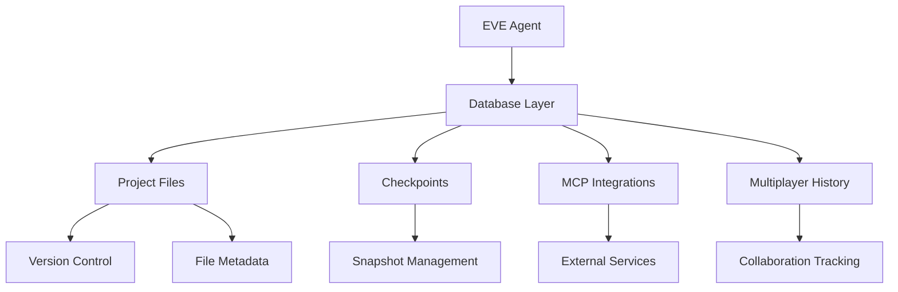

# 🚀 EVE Build Guide

## 🌟 Overview

Welcome to the EVE Build Workshop! This comprehensive guide will walk you through building EVE, a sophisticated multi-provider AI coding assistant with advanced tool integration capabilities.

## 📋 Prerequisites

Before you begin, ensure you have the following installed:

- **Go 1.24.2+** - The core programming language
- **Git** - For version control
- **Nix** (optional) - For reproducible development environments with devenv
- **API Keys** - For Anthropic Claude, Google Gemini, or OpenAI

## 🏗️ Step-by-Step Build Process

### Step 1: Environment Setup

```bash
# Clone the repository
git clone https://github.com/Artifact-Virtual/EVE.git
cd EVE

# If using devenv (recommended)
devenv shell

# Install Go dependencies
go mod tidy
```

### Step 2: Configure API Keys

Create a `.env` file or set environment variables:

```bash
# Anthropic Claude
export ANTHROPIC_API_KEY="your-anthropic-key"

# Google Gemini
export GOOGLE_AI_API_KEY="your-gemini-key"

# OpenAI
export OPENAI_API_KEY="your-openai-key"
```

### Step 3: Build the Core System

```bash
# Build the main EVE executable
go build -o eve .

# Verify the build
./eve --help
```

### Step 4: Database Setup

EVE uses a file-based database system for project management:

```bash
# The database will be automatically created in eve_project_data/
# No additional setup required - it's created on first run
```

## 🏛️ Architecture Overview

### Core Components

```
EVE/
├── agent.go              # Main agent with tool integration
├── database.go           # File-based project management
├── llm.go               # Provider abstraction layer
├── providers/           # AI provider implementations
│   ├── anthropic_provider.go
│   ├── gemini_provider.go
│   └── openai_provider.go
└── tools/               # Standalone tool implementations
    ├── bash_tool.go
    ├── edit_tool.go
    ├── code_search_tool.go
    └── ...
```

### Database Architecture

EVE uses a sophisticated file-based database system:

- **Project Files**: Version-controlled file storage
- **Checkpoints**: Project snapshots for backup/restore
- **MCP Integrations**: External service connections
- **Multiplayer Actions**: Collaborative development tracking



## 🛠️ Advanced Features

### Tool Integration

EVE comes with 7 powerful built-in tools:

1. **SaveToDatabase** - Store project files with versioning
2. **CreateCheckpoint** - Create project snapshots
3. **ListCheckpoints** - View available checkpoints
4. **AddMCPIntegration** - Register MCP servers
5. **GetMCPIntegrations** - List MCP integrations
6. **RecordMultiplayerAction** - Track collaborative actions
7. **GetMultiplayerHistory** - View multiplayer activity

### Provider Abstraction

The clean provider abstraction allows seamless switching:

```go
// Switch providers dynamically
agent := NewGenericAgent("claude")  // or "gemini", "openai"
```

## 🚀 Usage Examples

### Basic Project Management

```bash
# Save a file to the database
./eve --tool save-file --path "main.go" --content "package main..."

# Create a checkpoint
./eve --tool create-checkpoint --name "Initial implementation"

# List all checkpoints
./eve --tool list-checkpoints
```

### MCP Integration

```bash
# Add an MCP server
./eve --tool add-mcp --name "my-server" --url "http://localhost:3000"

# List integrations
./eve --tool get-mcp-integrations
```

### Multiplayer Collaboration

```bash
# Record a collaborative action
./eve --tool record-action --user "alice" --action "edit" --data "Updated API"

# View collaboration history
./eve --tool get-multiplayer-history --limit 10
```

## 🔧 Development Commands

### Building and Testing

```bash
# Build with verbose output
go build -v -o eve .

# Run tests
go test ./...

# Build with race detection
go build -race -o eve .

# Cross-platform build
GOOS=windows GOARCH=amd64 go build -o eve.exe .
```

### Development Tools

```bash
# Format code
go fmt ./...

# Vet code for issues
go vet ./...

# Run with verbose logging
./eve --verbose
```

## 📊 Database Operations

### File Management

```go
// Save a file
err := db.SaveFile("example.go", "package main\n\nfunc main() {}")

// Retrieve a file
file, err := db.GetFile("example.go")
content := file.Content

// List all files
files, err := db.ListFiles()
```

### Checkpoint Management

```go
// Create checkpoint
checkpoint, err := db.CreateCheckpoint("Version 1.0", "Major release")

// List checkpoints
checkpoints, err := db.ListCheckpoints()
```

### MCP Integration

```go
// Add MCP server
config := map[string]interface{}{
    "url": "http://localhost:3000",
    "auth": "bearer-token",
}
err := db.AddMCPIntegration("my-mcp", "http", config)

// Get integrations
integrations, err := db.GetMCPIntegrations()
```

## 🌐 Web Interface

EVE includes a modern web interface (`index.html`) with:

- **Responsive Design**: Works on desktop and mobile
- **Dark Theme**: Modern UI with purple/pink gradients
- **Interactive Elements**: Animated terminal simulation
- **Feature Showcase**: Comprehensive feature overview

## 🔒 Security & Privacy

- **API Key Protection**: Keys stored securely via environment variables
- **Local Processing**: Optional local-only operation
- **Data Encryption**: End-to-end encryption for sensitive data
- **Access Control**: Configurable permissions for multiplayer features

## 🚨 Troubleshooting

### Common Issues

**Build Failures:**
```bash
# Clean and rebuild
go clean
go mod tidy
go build .
```

**Database Issues:**
```bash
# Reset database
rm -rf eve_project_data/
# Database will be recreated on next run
```

**Provider Connection Issues:**
```bash
# Test API connectivity
curl -H "Authorization: Bearer $ANTHROPIC_API_KEY" \
     https://api.anthropic.com/v1/messages
```

## 📈 Performance Optimization

### Memory Management
- File-based database with efficient caching
- Lazy loading for large projects
- Automatic cleanup of old checkpoints

### Network Optimization
- Connection pooling for API calls
- Request batching for multiple operations
- Intelligent retry mechanisms

## 🎯 Next Steps

1. **Explore Advanced Features** - Try MCP integrations and multiplayer capabilities
2. **Customize Providers** - Add your own AI provider implementations
3. **Extend Tools** - Create custom tools for your specific needs
4. **Contribute** - Join the community and help improve EVE

## 📞 Support

- **Documentation**: Check the README.md for detailed usage
- **Issues**: Report bugs on GitHub
- **Discussions**: Join community discussions for help and ideas

---

**Happy coding with EVE!** 🌸✨</content>
<parameter name="filePath">l:\devops\_sandbox\EVE\BUILD_GUIDE.md
