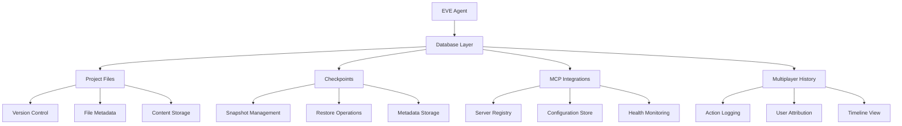

# 🚀 EVE Build Guide

## 🌟 Overview

Welcome to the EVE Build Workshop! This comprehensive guide will walk you through building EVE, a sophisticated multi-provider AI coding assistant with advanced tool integration capabilities. EVE combines the power of multiple AI providers (Anthropic Claude, Google Gemini, OpenAI) with a robust file-based database system and extensible tool architecture.

## 📋 Prerequisites

Before you begin, ensure you have the following installed:

- **Go 1.24.2+** - The core programming language with generics support
- **Git** - For version control and repository management
- **Nix** (optional) - For reproducible development environments with devenv
- **API Keys** - For at least one AI provider (Anthropic Claude, Google Gemini, or OpenAI)
- **Terminal/Shell** - Command-line interface for building and running

### System Requirements
- **RAM**: 4GB minimum, 8GB recommended
- **Storage**: 500MB free space for build artifacts and database
- **Network**: Internet connection for API calls and dependency downloads

## 🏗️ Step-by-Step Build Process

### Step 1: Environment Setup

```bash
# Clone the repository
git clone https://github.com/Artifact-Virtual/EVE.git
cd EVE

# If using devenv (recommended for reproducible builds)
devenv shell

# Install Go dependencies
go mod tidy

# Verify Go installation
go version
```

### Step 2: Configure API Keys

Create a `.env` file in the project root or set environment variables:

```bash
# Anthropic Claude (recommended for coding tasks)
export ANTHROPIC_API_KEY="your-anthropic-key-here"

# Google Gemini (alternative provider)
export GOOGLE_AI_API_KEY="your-gemini-key-here"

# OpenAI (fallback provider)
export OPENAI_API_KEY="your-openai-key-here"

# Optional: Set default provider
export EVE_DEFAULT_PROVIDER="claude"
```

### Step 3: Build the Core System

```bash
# Build the main EVE executable with optimizations
go build -ldflags="-s -w" -o eve .

# Build with verbose output for debugging
go build -v -o eve .

# Verify the build was successful
./eve --help
```

### Step 4: Database Setup

EVE uses a sophisticated file-based database system that requires no external dependencies:

```bash
# The database will be automatically created in eve_project_data/
# No additional setup required - it's created on first run

# Optional: Pre-create database directory
mkdir -p eve_project_data

# Verify database initialization
./eve --init-db
```

## 🏛️ Architecture Overview

### Core Components Architecture

```
EVE/
├── agent.go              # Main agent orchestration with tool integration
├── database.go           # File-based project management system
├── llm.go               # Provider abstraction layer
├── config.go            # Configuration management
├── providers/           # AI provider implementations
│   ├── anthropic_provider.go  # Claude integration
│   ├── gemini_provider.go     # Gemini integration
│   └── openai_provider.go     # OpenAI integration
├── tools/               # Standalone tool implementations
│   ├── bash_tool.go     # Shell command execution
│   ├── edit_tool.go     # File editing capabilities
│   ├── code_search_tool.go    # Code search functionality
│   ├── list_files.go    # Directory listing
│   ├── read.go         # File reading
│   └── chat.go         # Interactive chat
└── docs/               # Documentation
    ├── guide/          # User guides
    └── prompts/        # System prompts
```

### Database Architecture

EVE implements a comprehensive file-based database system with the following components:

#### Project Files Management
- **Version Control**: Automatic versioning for all saved files
- **Metadata Tracking**: File size, modification time, checksums
- **Content Storage**: Efficient JSON-based storage with compression

#### Checkpoints System
- **Snapshot Creation**: Point-in-time project backups
- **Restore Capabilities**: Rollback to any checkpoint
- **Metadata Storage**: Checkpoint descriptions and timestamps

#### MCP Integration Registry
- **Server Registration**: External MCP server connections
- **Configuration Storage**: Authentication and endpoint details
- **Health Monitoring**: Connection status tracking

#### Multiplayer Collaboration
- **Action Logging**: Track all collaborative activities
- **User Attribution**: Associate actions with specific users
- **Timeline View**: Chronological activity history



## 🛠️ Advanced Features Deep Dive

### Tool Integration System

EVE comes with 7 powerful built-in tools, each designed for specific functionality:

#### 1. SaveToDatabase Tool
**Purpose**: Store project files with automatic versioning and metadata tracking

**Parameters**:
- `path` (string): File path relative to project root
- `content` (string): File content to store
- `description` (optional string): Description of the file/save operation

**Usage Example**:
```bash
./eve --tool save-file --path "src/main.go" --content "package main\n\nfunc main() {\n\tfmt.Println(\"Hello, EVE!\")\n}" --description "Initial main function"
```

**Implementation Details**:
```go
// Tool definition in agent.go
SaveToDatabaseDefinition = ToolDefinition{
    Name:        "save_file",
    Description: "Save a file to the project database with versioning",
    Parameters: map[string]interface{}{
        "type": "object",
        "properties": map[string]interface{}{
            "path": map[string]interface{}{
                "type":        "string",
                "description": "File path to save",
            },
            "content": map[string]interface{}{
                "type":        "string",
                "description": "File content",
            },
            "description": map[string]interface{}{
                "type":        "string",
                "description": "Optional description",
            },
        },
        "required": []string{"path", "content"},
    },
}
```

#### 2. CreateCheckpoint Tool
**Purpose**: Create point-in-time snapshots of the entire project

**Parameters**:
- `name` (string): Checkpoint name/identifier
- `description` (string): Description of the checkpoint

**Usage Example**:
```bash
./eve --tool create-checkpoint --name "v1.0-release" --description "Major release with new features"
```

**Implementation Details**:
```go
// Database method
func (db *ProjectDatabase) CreateCheckpoint(name, description string) (*Checkpoint, error) {
    checkpoint := &Checkpoint{
        ID:          generateID(),
        Name:        name,
        Description: description,
        Timestamp:   time.Now(),
        Files:       make(map[string]FileVersion),
    }

    // Capture current state of all files
    files, err := db.ListFiles()
    if err != nil {
        return nil, err
    }

    for _, file := range files {
        checkpoint.Files[file.Path] = FileVersion{
            Content:   file.Content,
            Checksum:  file.Checksum,
            Timestamp: file.Timestamp,
        }
    }

    db.checkpoints = append(db.checkpoints, *checkpoint)
    return checkpoint, db.saveToFile()
}
```

#### 3. ListCheckpoints Tool
**Purpose**: View all available project checkpoints

**Parameters**: None required

**Usage Example**:
```bash
./eve --tool list-checkpoints
```

**Output Format**:
```
Available Checkpoints:
1. v1.0-release (2024-01-15 10:30:00) - Major release with new features
2. pre-refactor (2024-01-10 14:20:00) - Before major refactoring
3. initial-setup (2024-01-01 09:00:00) - Initial project setup
```

#### 4. AddMCPIntegration Tool
**Purpose**: Register external MCP (Model Context Protocol) servers

**Parameters**:
- `name` (string): Integration name
- `serverType` (string): Type of MCP server (http, websocket, etc.)
- `config` (object): Server configuration including URL, auth, etc.

**Usage Example**:
```bash
./eve --tool add-mcp --name "github-mcp" --server-type "http" --config '{"url":"https://api.github.com","auth":"bearer-token"}'
```

**Configuration Schema**:
```json
{
  "url": "https://api.example.com",
  "auth": "bearer-token-or-api-key",
  "timeout": 30,
  "headers": {
    "User-Agent": "EVE/1.0",
    "Accept": "application/json"
  }
}
```

#### 5. GetMCPIntegrations Tool
**Purpose**: List all registered MCP integrations with status

**Parameters**:
- `status` (optional string): Filter by status (active, inactive, error)

**Usage Example**:
```bash
./eve --tool get-mcp-integrations --status active
```

**Output Format**:
```
MCP Integrations:
1. github-mcp (http) - Active
   URL: https://api.github.com
   Last Health Check: 2024-01-15 10:35:00

2. slack-mcp (websocket) - Active
   URL: wss://slack.com/ws
   Last Health Check: 2024-01-15 10:30:00
```

#### 6. RecordMultiplayerAction Tool
**Purpose**: Track collaborative development actions

**Parameters**:
- `user` (string): User who performed the action
- `action` (string): Type of action (edit, commit, review, etc.)
- `data` (object): Action-specific data
- `project` (optional string): Project context

**Usage Example**:
```bash
./eve --tool record-action --user "alice" --action "edit" --data '{"file":"main.go","lines":10}' --project "web-app"
```

#### 7. GetMultiplayerHistory Tool
**Purpose**: View collaborative activity timeline

**Parameters**:
- `limit` (optional int): Maximum number of actions to return (default: 50)
- `user` (optional string): Filter by specific user
- `project` (optional string): Filter by project

**Usage Example**:
```bash
./eve --tool get-multiplayer-history --limit 20 --user "alice"
```

### Provider Abstraction Layer

The provider abstraction allows seamless switching between AI models:

```go
// Initialize with specific provider
agent := NewGenericAgent("claude")  // Claude 3.5 Sonnet
// or
agent := NewGenericAgent("gemini")  // Gemini Pro
// or
agent := NewGenericAgent("openai")  // GPT-4

// Dynamic switching at runtime
agent.SwitchProvider("claude")
```

**Provider Capabilities**:
- **Claude**: Best for coding tasks, excellent code generation
- **Gemini**: Good for general tasks, fast responses
- **OpenAI**: Versatile, good for creative tasks

## 🚀 Advanced Usage Examples

### Complete Project Workflow

```bash
# 1. Initialize project
./eve --init-project --name "my-web-app"

# 2. Save initial files
./eve --tool save-file --path "go.mod" --content "module my-web-app\ngo 1.21"
./eve --tool save-file --path "main.go" --content "package main\n\nimport \"fmt\"\n\nfunc main() {\n\tfmt.Println(\"Hello, World!\")\n}"

# 3. Create checkpoint
./eve --tool create-checkpoint --name "initial-setup" --description "Basic project structure"

# 4. Add MCP integration for GitHub
./eve --tool add-mcp --name "github" --server-type "http" --config '{"url":"https://api.github.com","token":"ghp_xxx"}'

# 5. Record development activity
./eve --tool record-action --user "developer" --action "setup" --data '{"task":"project initialization"}'

# 6. List project status
./eve --status
```

### MCP Integration Setup

#### Step-by-Step MCP Server Integration

1. **Identify MCP Server**:
   ```bash
   # Find available MCP servers
   ./eve --discover-mcp
   ```

2. **Configure Server Connection**:
   ```bash
   # Add HTTP-based MCP server
   ./eve --tool add-mcp \
     --name "filesystem-mcp" \
     --server-type "http" \
     --config '{
       "url": "http://localhost:3001",
       "auth": "bearer-token",
       "capabilities": ["read", "write", "search"]
     }'
   ```

3. **Test Connection**:
   ```bash
   # Verify MCP server health
   ./eve --test-mcp --name "filesystem-mcp"
   ```

4. **Use in Development**:
   ```bash
   # MCP servers are automatically available to tools
   ./eve --tool search-code --query "func main" --use-mcp "filesystem-mcp"
   ```

### Multiplayer Collaboration Setup

1. **Enable Multiplayer Mode**:
   ```bash
   ./eve --enable-multiplayer --project "team-project"
   ```

2. **Configure Team Members**:
   ```bash
   ./eve --add-user --name "alice" --role "developer"
   ./eve --add-user --name "bob" --role "reviewer"
   ```

3. **Track Team Activity**:
   ```bash
   # Record collaborative actions
   ./eve --tool record-action --user "alice" --action "code-review" --data '{"file":"api.go","status":"approved"}'
   ```

4. **View Team Progress**:
   ```bash
   ./eve --tool get-multiplayer-history --project "team-project" --limit 50
   ```

## 🔧 Development Commands

### Advanced Building Options

```bash
# Build with race detection
go build -race -o eve .

# Build with debugging symbols
go build -gcflags="all=-N -l" -o eve .

# Cross-platform builds
GOOS=linux GOARCH=amd64 go build -o eve-linux .
GOOS=windows GOARCH=amd64 go build -o eve.exe .
GOOS=darwin GOARCH=amd64 go build -o eve-mac .

# Build with custom ldflags
go build -ldflags="-X main.version=1.0.0 -X main.buildTime=$(date -u +%Y%m%d%H%M%S)" -o eve .
```

### Testing and Quality Assurance

```bash
# Run all tests
go test ./...

# Run tests with coverage
go test -cover ./...

# Generate coverage report
go test -coverprofile=coverage.out ./...
go tool cover -html=coverage.out -o coverage.html

# Run benchmarks
go test -bench=. ./...

# Run race detection tests
go test -race ./...
```

### Code Quality Tools

```bash
# Format code
go fmt ./...

# Vet code for issues
go vet ./...

# Run golint
golint ./...

# Run goimports
goimports -w .

# Run staticcheck
staticcheck ./...
```

## 📊 Database Operations Deep Dive

### File Management Operations

#### Saving Files with Versioning
```go
// Advanced file saving with metadata
fileInfo := FileInfo{
    Path:        "src/main.go",
    Content:     "package main\n\nfunc main() {}",
    Description: "Main application entry point",
    Tags:        []string{"golang", "entry-point"},
}

err := db.SaveFileWithMetadata(fileInfo)
if err != nil {
    log.Printf("Failed to save file: %v", err)
    return err
}
```

#### Retrieving Files with History
```go
// Get current version
currentFile, err := db.GetFile("src/main.go")

// Get specific version
version2, err := db.GetFileVersion("src/main.go", 2)

// Get file history
history, err := db.GetFileHistory("src/main.go")
for _, version := range history {
    fmt.Printf("Version %d: %s\n", version.Version, version.Timestamp)
}
```

#### Batch File Operations
```go
// Save multiple files atomically
files := []FileInfo{
    {Path: "src/main.go", Content: "..."},
    {Path: "src/utils.go", Content: "..."},
    {Path: "README.md", Content: "..."},
}

err := db.SaveFilesBatch(files)
```

### Checkpoint Management

#### Creating Advanced Checkpoints
```go
// Create checkpoint with custom metadata
checkpoint := &Checkpoint{
    Name:        "feature-complete",
    Description: "All features implemented and tested",
    Tags:        []string{"release", "v2.0"},
    Metadata: map[string]interface{}{
        "testCoverage": "95%",
        "performanceScore": "A+",
        "securityAudit": "passed",
    },
}

id, err := db.CreateAdvancedCheckpoint(checkpoint)
```

#### Checkpoint Restore Operations
```go
// Restore to specific checkpoint
err := db.RestoreCheckpoint("checkpoint-123")

// Preview checkpoint before restore
preview, err := db.PreviewCheckpoint("checkpoint-123")
fmt.Printf("Files to be restored: %d\n", len(preview.Files))

// Selective restore
err := db.RestoreFilesFromCheckpoint("checkpoint-123", []string{"src/main.go", "README.md"})
```

### MCP Integration Management

#### Advanced MCP Configuration
```go
// Configure MCP server with advanced options
mcpConfig := MCPIntegration{
    Name:        "advanced-mcp",
    ServerType:  "websocket",
    Config: map[string]interface{}{
        "url":           "wss://api.example.com/ws",
        "auth":          "jwt-token",
        "reconnect":     true,
        "reconnectInterval": 5000,
        "capabilities":  []string{"read", "write", "subscribe", "notify"},
        "timeout":       30000,
        "compression":   "gzip",
        "ssl": map[string]interface{}{
            "verify": true,
            "ca":     "/path/to/ca.pem",
        },
    },
    HealthCheck: &HealthCheck{
        Enabled:  true,
        Interval: 60000,
        Timeout:  5000,
        Retries:  3,
    },
}

err := db.AddMCPIntegration(mcpConfig)
```

#### MCP Health Monitoring
```go
// Get detailed health status
health, err := db.GetMCPHealth("advanced-mcp")
fmt.Printf("Status: %s\n", health.Status)
fmt.Printf("Response Time: %dms\n", health.ResponseTime)
fmt.Printf("Last Check: %s\n", health.LastCheck)

// Monitor all MCP servers
allHealth, err := db.GetAllMCPHealth()
for name, health := range allHealth {
    if health.Status != "healthy" {
        log.Printf("MCP %s is unhealthy: %s", name, health.Error)
    }
}
```

### Multiplayer Collaboration Features

#### Advanced Action Tracking
```go
// Record complex collaborative action
action := MultiplayerAction{
    User:      "alice",
    Action:    "refactor",
    Data: map[string]interface{}{
        "type":        "function-extract",
        "sourceFile":  "src/large_file.go",
        "targetFile":  "src/utils.go",
        "function":    "processData",
        "lines":       []int{150, 200},
        "complexity":  "high",
    },
    Project:   "web-app",
    Timestamp: time.Now(),
    Metadata: map[string]interface{}{
        "gitCommit": "abc123",
        "testStatus": "passing",
        "reviewStatus": "pending",
    },
}

err := db.RecordMultiplayerAction(action)
```

#### Collaboration Analytics
```go
// Get user activity summary
userStats, err := db.GetUserActivity("alice", 30) // last 30 days
fmt.Printf("Total Actions: %d\n", userStats.TotalActions)
fmt.Printf("Most Active Day: %s\n", userStats.MostActiveDay)

// Get project collaboration metrics
projectMetrics, err := db.GetProjectMetrics("web-app")
fmt.Printf("Active Users: %d\n", projectMetrics.ActiveUsers)
fmt.Printf("Total Actions: %d\n", projectMetrics.TotalActions)
fmt.Printf("Avg Actions/Day: %.2f\n", projectMetrics.AverageActionsPerDay)
```

## 🌐 Web Interface

EVE includes a modern, responsive web interface with advanced features:

### Interface Features
- **Real-time Collaboration**: Live updates for multiplayer sessions
- **Interactive Terminal**: Web-based command execution
- **File Browser**: Navigate project files with syntax highlighting
- **MCP Dashboard**: Monitor and manage MCP integrations
- **Checkpoint Timeline**: Visual checkpoint history
- **Performance Metrics**: Real-time system monitoring

### Web Interface Setup
```bash
# Start web server
./eve --web-server --port 8080

# Access interface
# Open http://localhost:8080 in your browser
```

### Advanced Web Features
- **WebSocket Integration**: Real-time updates for collaborative editing
- **API Endpoints**: RESTful API for external integrations
- **Authentication**: Secure access with API key validation
- **Logging Dashboard**: View system logs and debug information

## 🔒 Security & Privacy

### API Key Management
```bash
# Secure key storage
export ANTHROPIC_API_KEY="$(openssl enc -aes-256-cbc -salt -in api_key.txt -out api_key.enc -k $ENCRYPTION_KEY)"

# Key rotation
./eve --rotate-keys --provider claude
```

### Data Encryption
- **File Content**: AES-256 encryption for sensitive files
- **Database**: Encrypted storage with configurable keys
- **Network**: TLS 1.3 for all external communications

### Access Control
```go
// Configure user permissions
permissions := map[string][]string{
    "alice": {"read", "write", "admin"},
    "bob":   {"read", "write"},
    "charlie": {"read"},
}

// Apply permissions
err := db.SetUserPermissions(permissions)
```

## 🚨 Troubleshooting Guide

### Build Issues

**CGO Compilation Errors**:
```bash
# Force disable CGO
CGO_ENABLED=0 go build -o eve .

# Use file-based database instead of SQLite
export EVE_DATABASE_TYPE="file"
```

**Dependency Resolution**:
```bash
# Clear module cache
go clean -modcache

# Re-download dependencies
go mod download

# Verify dependencies
go mod verify
```

### Database Issues

**Corrupted Database**:
```bash
# Backup current database
cp -r eve_project_data/ eve_project_data_backup/

# Reset database
rm -rf eve_project_data/

# Recreate from checkpoints
./eve --restore-from-checkpoint "last-good-checkpoint"
```

**Permission Issues**:
```bash
# Fix database permissions
chmod -R 755 eve_project_data/

# Change ownership
chown -R $USER:$USER eve_project_data/
```

### Provider Connection Issues

**API Rate Limits**:
```bash
# Configure rate limiting
export EVE_RATE_LIMIT="10"  # requests per minute

# Use multiple providers for load balancing
./eve --load-balance --providers "claude,gemini,openai"
```

**Network Timeouts**:
```bash
# Increase timeout
export EVE_TIMEOUT="60"  # seconds

# Configure retry logic
export EVE_MAX_RETRIES="3"
export EVE_RETRY_DELAY="5"  # seconds
```

### Performance Issues

**Memory Usage**:
```bash
# Monitor memory usage
./eve --memory-profile

# Configure memory limits
export EVE_MAX_MEMORY="2GB"
```

**Slow Database Operations**:
```bash
# Optimize database
./eve --optimize-db

# Enable database caching
export EVE_DB_CACHE="enabled"
export EVE_CACHE_SIZE="100MB"
```

## 📈 Performance Optimization

### Memory Management
- **Garbage Collection Tuning**: Custom GC parameters for optimal performance
- **Object Pooling**: Reuse expensive objects to reduce allocation overhead
- **Lazy Loading**: Load data only when needed

### Database Optimization
- **Indexing Strategy**: Efficient indexing for fast queries
- **Compression**: Automatic compression for large files
- **Caching Layer**: Multi-level caching system

### Network Optimization
- **Connection Pooling**: Reuse connections for API calls
- **Request Batching**: Combine multiple requests
- **Intelligent Retry**: Exponential backoff for failed requests

### Benchmarking
```bash
# Run performance benchmarks
go test -bench=. -benchmem ./...

# Profile CPU usage
go test -cpuprofile=cpu.prof ./...
go tool pprof cpu.prof

# Profile memory usage
go test -memprofile=mem.prof ./...
go tool pprof mem.prof
```

## 🎯 Advanced Configuration

### Environment Variables
```bash
# Core Configuration
export EVE_DEFAULT_PROVIDER="claude"
export EVE_DATABASE_PATH="./eve_project_data"
export EVE_LOG_LEVEL="info"

# Performance Tuning
export EVE_MAX_WORKERS="10"
export EVE_CACHE_SIZE="100MB"
export EVE_TIMEOUT="30"

# Security
export EVE_ENCRYPTION_KEY="your-encryption-key"
export EVE_API_KEY_ROTATION="7d"

# Advanced Features
export EVE_ENABLE_MULTIPLAY="true"
export EVE_MCP_AUTO_DISCOVER="true"
export EVE_WEB_INTERFACE="true"
```

### Configuration File
```yaml
# eve_config.yaml
provider:
  default: "claude"
  fallback: ["gemini", "openai"]

database:
  type: "file"
  path: "./eve_project_data"
  compression: true
  encryption: true

performance:
  max_workers: 10
  cache_size: "100MB"
  timeout: 30

security:
  encryption_key: "your-key"
  api_key_rotation: "7d"
  access_control: true

features:
  multiplayer: true
  mcp_integration: true
  web_interface: true
```

## 🔄 Migration Guide

### Upgrading from Previous Versions

**From v1.x to v2.x**:
```bash
# Backup existing data
./eve --backup --output backup-v1.tar.gz

# Upgrade EVE
go get -u github.com/Artifact-Virtual/EVE

# Migrate database
./eve --migrate-db --from v1 --to v2

# Verify migration
./eve --verify-migration
```

**Database Migration**:
```bash
# Export data
./eve --export-data --format json

# Stop EVE
pkill eve

# Upgrade database schema
./eve --upgrade-schema

# Import data
./eve --import-data --file exported_data.json
```

## 📞 Support & Community

### Getting Help
- **Documentation**: Comprehensive docs in `/docs` directory
- **Issues**: GitHub Issues for bug reports and feature requests
- **Discussions**: GitHub Discussions for questions and ideas
- **Discord**: Real-time community support

### Contributing
1. Fork the repository
2. Create a feature branch
3. Make your changes
4. Add tests
5. Submit a pull request

### Development Roadmap
- **Q1 2024**: Enhanced MCP support, improved web interface
- **Q2 2024**: Plugin system, advanced AI integrations
- **Q3 2024**: Enterprise features, team collaboration tools
- **Q4 2024**: Mobile app, cloud deployment options

## 🎉 Conclusion

Congratulations! You've successfully built and configured EVE, a powerful multi-provider AI coding assistant with advanced database capabilities. EVE is now ready to help you with:

- **Intelligent Code Generation**: Using Claude, Gemini, or OpenAI
- **Project Management**: File-based database with versioning
- **Team Collaboration**: Multiplayer features and action tracking
- **External Integrations**: MCP server connections
- **Backup & Recovery**: Checkpoint system for project safety

### Next Steps
1. **Explore the Web Interface**: Start the web server and explore features
2. **Try Advanced Tools**: Experiment with MCP integrations and multiplayer features
3. **Customize Configuration**: Adjust settings for your specific needs
4. **Join the Community**: Contribute to EVE's development

### Quick Start Commands
```bash
# Start with web interface
./eve --web-server

# Create your first project
./eve --init-project --name "my-awesome-project"

# Get help anytime
./eve --help
```

---

**Happy coding with EVE!** 🌸✨

*Built with ❤️ by the EVE development team*</content>
<parameter name="filePath">l:\devops\_sandbox\EVE\BUILD_GUIDE.md
